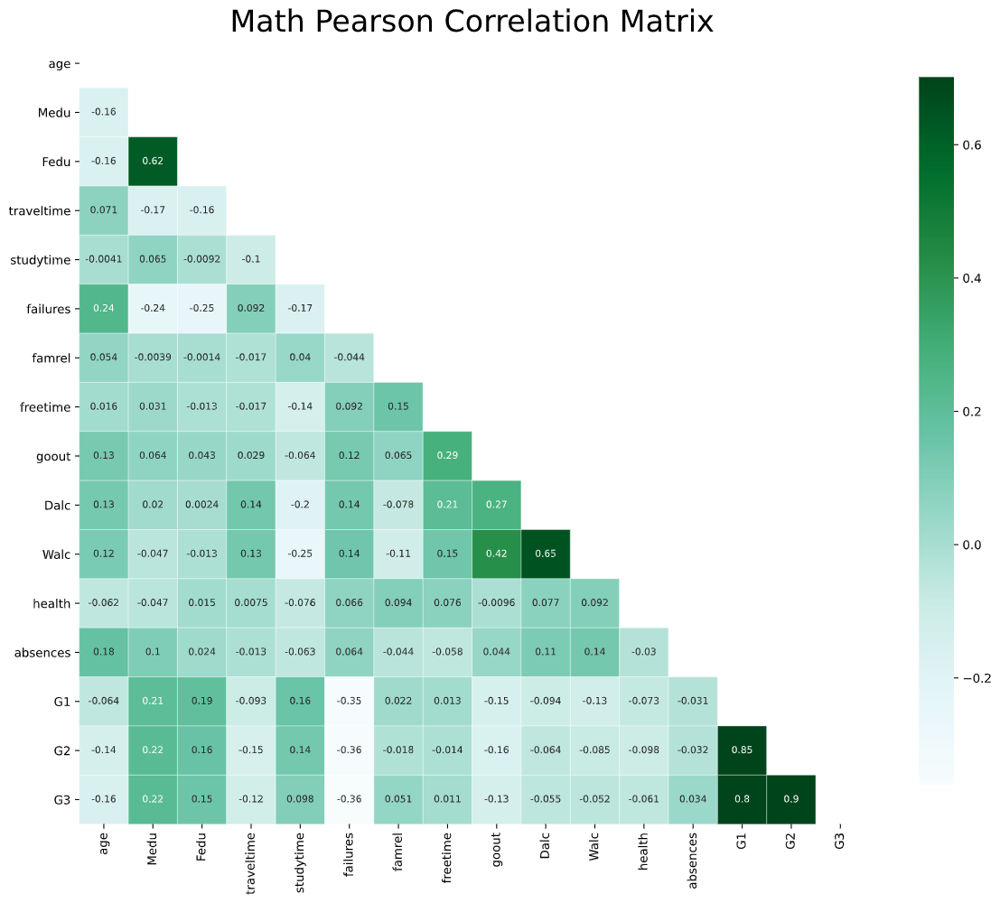
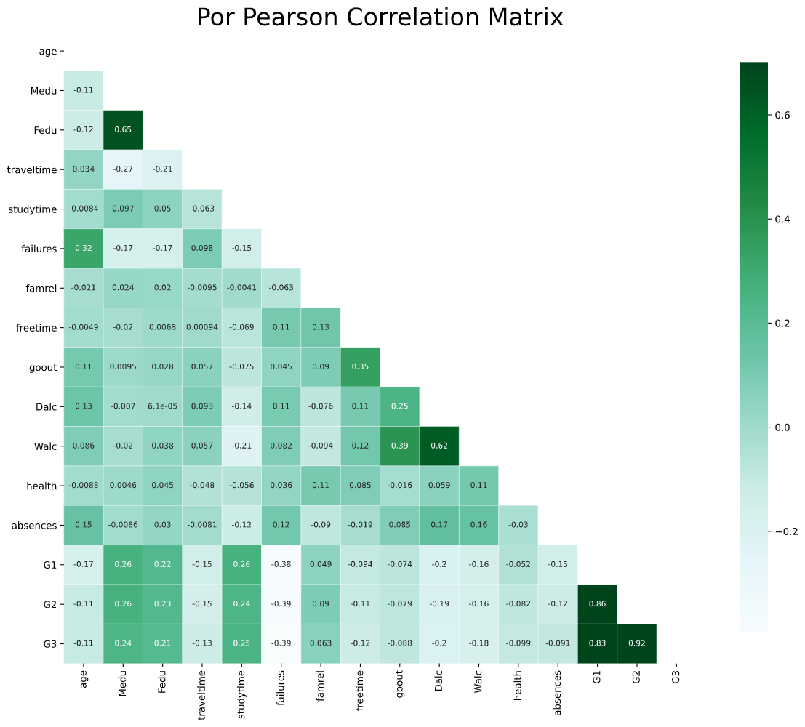
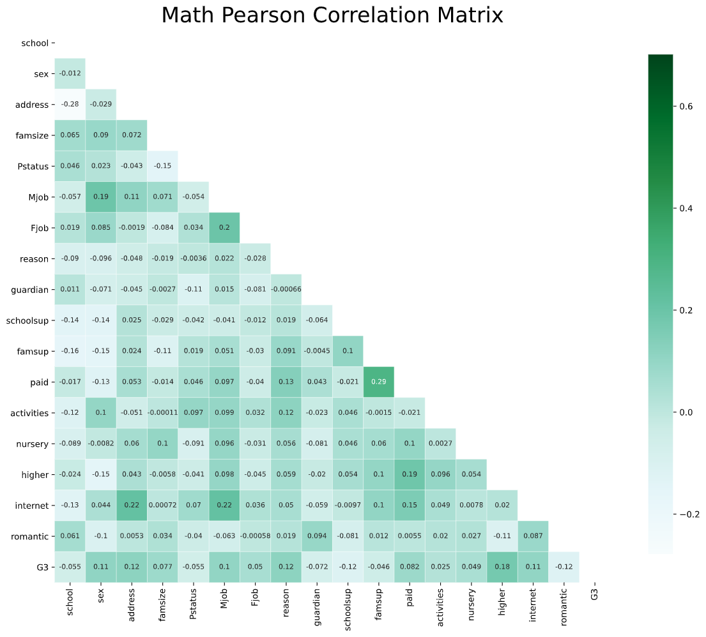
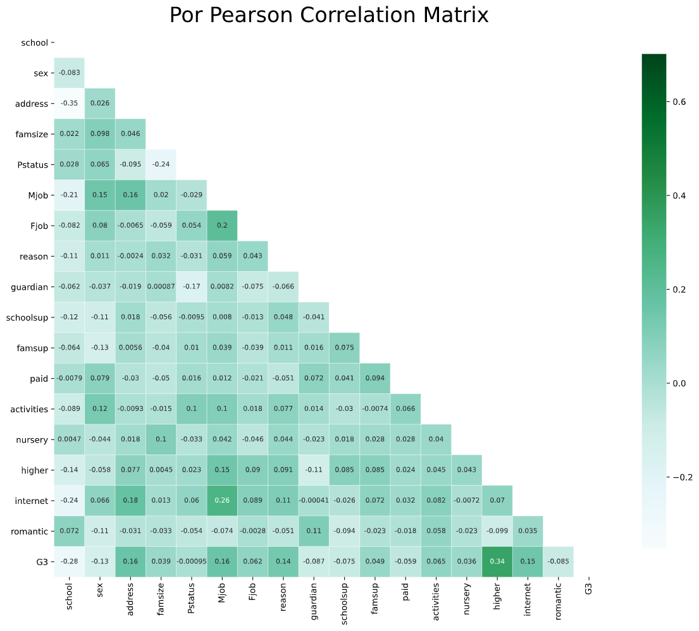
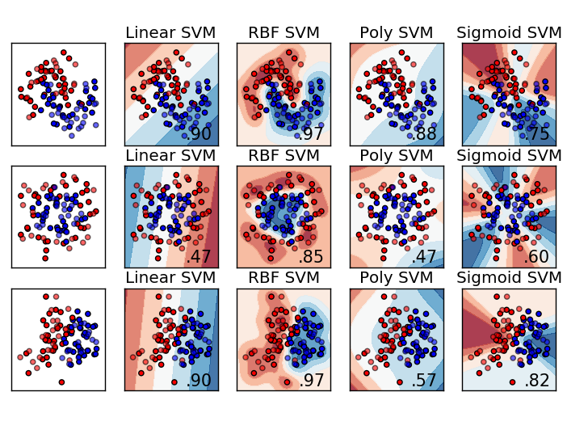
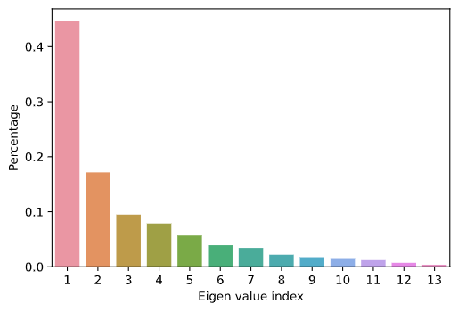
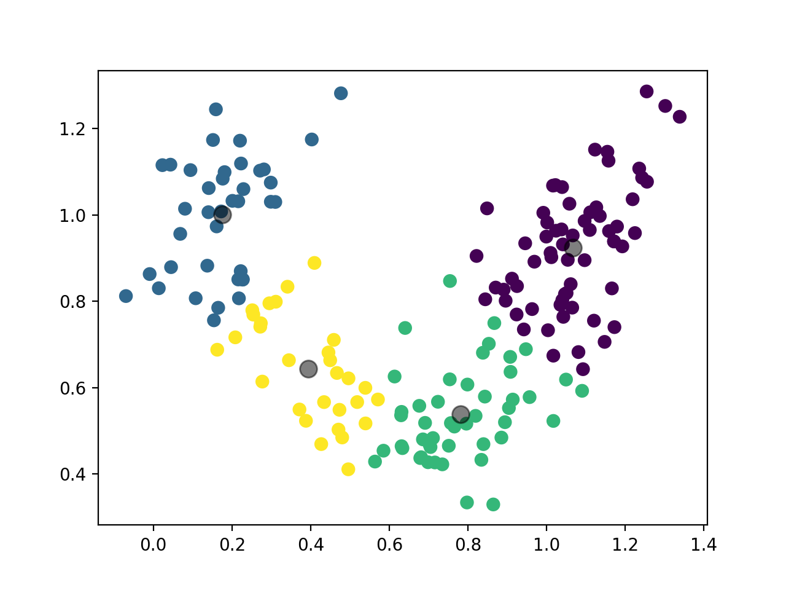

# AI基础第二次编程作业：统计机器学习

### 李喆昊 PB17050941

## 目录 

1. **有监督学习**
   1. 数据集介绍与统计分析
   2. KNN
      1. 原理介绍
      2. 实现与测试
   3. SVM
      1. 原理介绍
      2. 实现与测试
   4. Logisitic Regression
      1. 原理介绍
      2. 实现与测试
2. **无监督学习**
   1. 数据集介绍
   2. PCA
      1. 原理介绍
      2. 实现与测试
   3. K-means
      1. 原理介绍
      2. 实现与测试
3. **总结与反思**


## 一. 有监督学习

有监督学习指训练数据有标签的一类统计机器学习模式。常用方法有KNN、SVM、Logistic Regression、深度神经网络等。

1. **数据集介绍与统计分析**

   本次实验采用的是UCI大学的学生信息及在校表现数据集， 提供了数学和葡萄牙语两个科目的数据，包含学生成绩、家庭背景、生活习惯等共33个属性。数学数据集和葡萄牙语数据集分别有395条数据和649条数据，

   数据属性中有些取值为字符串，如学校，性别，父母职业等，另外一些取值为数值，如学习时间，在校成绩等。我们的目标是预测学生的在校最终成绩G3。为了选取最合适的特征进行学习，我首先分析了取值为数值的属性与G3的相关性关系，如下图所示。

   数学数据集：

   

   葡萄牙语数据集：

   

   可以看到：在两个数据集中，G1，G2与G3有着非常强的正相关关系。Medu，Fedu代表的父母教育程度也对孩子的最终成绩有着较大的正相关关系。有趣的是，学习时间与葡萄牙语最终成绩正相关性较强（0.25），但与数学最终成绩正相关性较弱（0.098）。除此之外，在两个数据集中，failure属性代表的学生在课堂中的失败次数与G3有着较强的负相关关系。年龄、旅行时间与G3也有一定的负相关关系。

   对于取值为字符串的属性，我使用``sklearn.preprocessing.LabelEncoder()``将其转换为数值，作相关性矩阵如下：

   数学数据集：

   

   葡萄牙语数据集：

   

   从结果可以看到，葡萄牙语数据集中，学校和G3有种较强的负相关关系，higer属性代表的“是否想进入高等学校学习”与葡萄牙语G3成绩有种较强的正相关关系。除此之外，在两个数据集中，性别、住址、母亲的工作、进入学校的原因、家庭中是否有互联网都与G3有一定的相关关系。

   根据上面的分析结果，我们可以制定特征选取的策略如下：

   1. 选取G1，G2预测G3  
   2. 选取除G1，G2外的其他所有特征预测G3

   3. 选取与G3相关性较强的Medu，Fedu，failures，age，traverltime，sex，address，Mjob，reason，internet，higher预测G3

   通过对数据进行统计分析后发现没有离群值，不需要进行数据删减。

   将数据集按照7:3的比例划分为训练集与测试集。

   | 数据集   | 数据总数 | 训练集大小 | 测试集大小 |
   | -------- | -------- | ---------- | ---------- |
   | 数学     | 395      | 276        | 119        |
   | 葡萄牙语 | 649      | 454        | 195        |

    

    

    

   

2. **KNN**

   1. 原理介绍

      KNN是K Nearest Neighbor的缩写。正所谓“物以类聚”，KNN算法的核心思想是：同一类数据样本在特征空间中的分布位置是相近的。因此，对于一个未知类别的测试样本，我们可以通过计算与其在特征空间中距离最近的K的点，以这K个点中占比最多的类型作为测试样本的类型。

   2. 实现方式与测试结果

      实现KNN的关键问题是：如何计算测试样本与其他所有已分类样本的距离（这里使用的是欧式距离），并选取最近的K个样本的标签进行投票。

      计算距离可以使用``numpy``的broadcast机制，核心代码如下：

      ```python
      distance = ((testdata - dataset)**2).sum(axis = 1)
      idx = np.argsort(distance)
      idx = idx[:K] # select the cloest K points 
      ```
      
      投票：
      
      ```python
      predict_label = 1 if train_label[knn_idx].sum() > K / 2 else 0
      ```
      
      **测试结果**
      
      选取的参考点点数量K对结果的影响（每组实验做10次取平均）
      
      使用特征集1 = [G1，G2]
      
      | K    | Math F1 | Portuguese F1 |
      | ---- | ------- | ------------- |
      | 1    | 0.9669  | 0.9890        |
      | 3    | 0.9834  | 0.9926        |
      | 5    | 0.9890  | 0.9939        |
      | 9    | 0.9899  | 0.9954        |
      | 15   | 0.9904  | 0.9963        |
      | 30   | 0.9927  | 0.9693        |
      
      <center>表1. 使用G1，G2特征下不同K在两个数据集上的表现 </center>
      
      
      
      使用特征集2 = [除G1，G2外的所有特征]：
      
      | K    | Math F1 | Portuguese F1 |
      | ---- | ------- | ------------- |
      | 1    | 0.8125  | 0.9265        |
      | 3    | 0.8180  | 0.9332        |
      | 5    | 0.8120  | 0.9306        |
      | 9    | 0.8099  | 0.9290        |
      | 15   | 0.8168  | 0.9257        |
      | 30   | 0.8684  | 0.9212        |
      
      <center>表2. 使用除G1，G2外其他特征下不同K在两个数据集上的表现 </center>
      
      使用特征集3 = [ Medu，Fedu，failures，age，traverltime，sex，address，Mjob，reason，internet，higher ]：
      
      | K    | Math F1 | Portuguese F1 |
      | ---- | ------- | ------------- |
      | 1    | 0.7914  | 0.9274        |
      | 3    | 0.8134  | 0.9311        |
      | 5    | 0.8047  | 0.9328        |
      | 9    | 0.8158  | 0.9306        |
      | 15   | 0.8338  | 0.9292        |
      | 30   | 0.9610  | 0.9240        |
      
      <center>表3. 使用自己选取的其他特征下不同K在两个数据集上的表现 </center>
      
      **结果分析**
      
      1. 特征的选取上：
      
         对比表2与表3，在K = 9, 15, 30时，在数学数据集上，特征集3下KNN的表现优于特征集2下的表现，K=30时差异尤为明显；K= 5, 9, 15, 30时，在葡萄牙语数据集上，特征集3下KNN的表现优于特征集2下的表现，在一定程度上可以证明特征选取的有效性。
      
      2. K对F1的影响：
      
         从表1，2，3可以看出，随着K在1-15范围增大，KNN算法的表现可能会先增大后减小，原因可能是当考察的样本过多时，一些与测试样本空间距离较远的点也被考虑，导致了分类准确度的降低。
      
      

3. **SVM**

   1. 原理介绍

      SVM是Support Vector Machine的缩写。SVM的核心思想是寻找能够将数据样本进行分类的超平面，并使得该超平面到被其分隔开的两类样本的最小距离最大化。与最终得到的超平面取得最小距离的那些数据样本被称为“支持向量”，从被划分开的两类样本中各取一个支持向量，它们到超平面的距离之和被称为“Margin”（下图中的m）。

      

      首先我们考察只能对线性可分数据进行划分的支持向量机（被称为“Hard Margin SVM”），其算法过程可以被概括为一个最优化问题：
      $$
      \max_{w,b} \frac{1}{\|w\|} \\ s.t. \ 1 - y_i(w^Tx_i + b) \leq 0 \\ y_i \in \{-1,1\} \tag{1}
      $$
      为了求解这一问题，我们将原问题改写一下，并使用Lagrangian乘子法。
      $$
      \min_{w,b} \frac{1}{2}\|w\|^2 \\ s.t. \ 1 - y_i(wx_i + b) \leq 0 \tag{2}
      $$

      $$
      \Leftrightarrow \max_{\alpha \geq 0} \min_{w,b} L(\alpha,w,b) =  \frac{1}{2}\|w\|^2 + \sum_{i = 1}^n\alpha_i(1 - y_i(wx_i + b) )\tag{3}
      $$

      求解$(3)$并整理，我们会得到一个新的约束问题：
      $$
      \max_{\alpha} \sum_{i=1}^n\alpha_i - \frac{1}{2}\sum_{i,j=1}^n\alpha_i\alpha_jy_iy_j\langle x_i,x_j\rangle  \tag{4}  \\ \alpha_i \geq 0 \\ \sum_{i=1}^n \alpha_i y_i = 0
      $$
      当数据线性不可分时，我们可以使用“Soft Margin”形式的支持向量机，其核心思想是：允许一定程度的分类错误，以支持两类数据样本“你中有我，我中有你”的线性不可分情况，但是我们需要对分类的错误进行惩罚，该惩罚在损失函数中体现为一个正则化项，如下所示。
      $$
      \min_{w,b} \frac{1}{2}\|w\|^2 + C\sum_{i}\xi_i \\
      s.t. \ y_i(w_i^T x_i + b) \geq 1 - \xi_i \\
      \xi_i \geq 0 \tag{5}
      $$


      对应的对偶问题为：
      $$
      \max_{\alpha} \sum_{i=1}^n\alpha_i - \frac{1}{2}\sum_{i,j=1}^n\alpha_i\alpha_jy_iy_j\langle x_i,x_j\rangle  \tag{6}  \\  C \geq \alpha_i \geq 0 \\ \sum_{i=1}^n \alpha_i y_i = 0
      $$
      除了引入对分类错误的允许，SVM还有一个强力的技巧被称为“kernel trick”，其本质是：将在原来特征空间中线性不可分的数据映射到另一个特征空间，使得在新特征空间中，样本能够被线性划分。

      可以看到，$(6)$式被优化的目标函数中，数据样本以$\langle x_i, x_i \rangle$内积的形式出现。假设特征空间之间的映射函数为$\phi(x)$, 则变换后, 样本之间的内积为$\langle \phi(x_i), \phi(x_j) \rangle$。由于$\phi(x)$可能为隐函数不便于计算，实际中我们只需要计算内积$K(x_i,x_j) = \langle \phi(x_i), \phi(x_j) \rangle$ 即可，该函数被定义为“核函数”。

      我们知道，一个线性空间中的内积定义了空间中的几何度量方式，改变内积实质上将改变样本之间的相似性度量，从而使得样本的空间位置分布发生变化。这让在新特征空间中对样本进行线性划分成为可能，如下图的例子所示，图片右下角的数字为分类准确率。

      

      这里我们会有一个疑问：是否一定需要使用原问题的Lagrangian对偶形式进行SVM的求解？

      答案是不一定。$(4)$式相比于$(2)$式的优势是：求解的复杂度在高维度下更低：$(2)$式的求解复杂度与$w$的维度成正比，$(4)$式的复杂度与样本数量$n$成正比。如果是线性分类且样本数量明显多于样本维度时，使用原问题求解即可。如果是非线性分类且使用核函数进行升维后（如RBF核函数将数据升到无穷维），使用对偶问题更有优势。

      

   2. 实现方式与测试结果

      实现SVM的关键问题是构造$(6)$式的二次规划问题，并使用`qpsolver.solve_qp()`方法求解。核心代码如下。

      ```python
      P = np.zeros((ndata,ndata))
      for i in range(ndata):
      	P[i] = np.array([kernel(train_data[j], train_data[i]) for j in range(ndata)])
      P = .5 * P * train_label.reshape((ndata, 1)) * train_label.reshape((1, ndata))   
      P = P + 1e-8 * np.eye(ndata) # add a small perturbation to ensure positive definite
      
      q = -np.ones(ndata)
      lb = np.full(ndata, 0.0)
      ub = np.full(ndata, C)
      
      A = np.array(train_label, dtype= np.float)
      b = np.array([0.])
      
      # use quadratic programming to solve alpha
      alpha = qs.solve_qp(P, q, G=None, h=None, A=A, b=b, lb=lb, ub=ub)
      ```

      **测试结果与分析**

      + 特征集1 = [G1，G2]
      + 特征集2 = [除G1，G2外的所有特征]

      线性核函数
      $$
      K(x,y) = \langle x, y\rangle
      $$

      | 特征集 | C     | Math F1 | Portuguese F1 |
      | ------ | ----- | ------- | ------------- |
      | 1      | 50    | 0.9014  | 0.9578        |
      | 1      | 200   | 0.8950  | 0.9544        |
      | 1      | 500   | 0.9281  | 0.9439        |
      | 1      | 2000  | 0.9178  | 0.9477        |
      | 1      | 10000 | 0.9452  | 0.8816        |
      | 2      | 50    | 0.8317  | 0.9357        |
      | 2      | 200   | 0.8394  | 0.7902        |
      | 2      | 500   | 0.6887  | 0.8991        |
      | 2      | 2000  | 0.6908  | 0.8991        |
      | 2      | 10000 | 0.1957  | 0.8361        |

      <center>表4. 线性核函数分别在特征集1、2上调整C的表现 </center>

      RBF核函数
      $$
      K(x,y) = \exp\{ - \gamma * \| x - y \|^2 \}
      $$

      | 特征集 | C     | $\gamma$ | Math F1 | Portuguese F1 |
      | ------ | ----- | -------- | ------- | ------------- |
      | 1      | 50    | 0.01     | 0.8333  | 0.            |
      | 1      | 200   | 0.01     | 0.9371  | 0.9358        |
      | 1      | 500   | 0.01     | 0.9189  | 0.8997        |
      | 1      | 2000  | 0.01     | 0.9500  | 0.9408        |
      | 1      | 10000 | 0.01     | 0.8840  | 0.9588        |
      | 2      | 200   | 1        | 0.7760  | 0.6693        |
      | 2      | 200   | 0.1      | 0.7806  | 0.6532        |
      | 2      | 200   | 0.01     | 0.7822  | 0.6893        |
      | 2      | 200   | 0.001    | 0.7840  | 0.7211        |
      | 2      | 200   | 0.0001   | 0.7851  | 0.7401        |

      <center>表5. RBF核函数分别在特征集1、2上调整C、gamma的表现 </center>

      多项式核函数
      $$
      K(x,y) = (\langle x , y\rangle + 1)^n
      $$

      | 特征集 | C    | 幂次 | Math F1  | Portuguese F1 |
      | ------ | ---- | ---- | -------- | ------------- |
      | 1      | 500  | 2    | 0.6491   | 0.9588        |
      | 1      | 500  | 3    | 0.8718   | 0.9308        |
      | 1      | 500  | 5    | 0.8040   | 0.8541        |
      | 1      | 500  | 10   | 0.6833   | 0.8392        |
      | 2      | 500  | 2    | 0.8100   | 0.6107        |
      | 2      | 500  | 3    | 0.8390   | 0.9256        |
      | 2      | 500  | 5    | 0.8720   | 0.8983        |
      | 2      | 500  | 10   | 无法求解 | 无法求解      |

      <center>表6. 多项式核函数分别在特征集1、2上调整n的表现 </center>

      **结果分析**

      1. 线性核函数

         分析表4，随着C的增加，SVM的表现的一般趋势是先上升再下降，这是因为当C过大时会出现过拟合现象。

      2. RBF核函数

         几何上，我们可以直观地将RBF函数中的参数$\gamma$理解为超平面的弯曲程度，当$\gamma$越大时，越容易出现将数据包裹起来的“岛”，而C则影响着超平面的尖锐程度，当C越大时，由于对分类错误惩罚的加重，超平面会变得更加尖锐。从表5可以看到，固定$\gamma$，增加C，趋势与线性核函数类似。当固定C=200时，减少$\gamma$时，表现逐渐增加，其增加的原因可能是：由于C=200时线性核函数的表现较好（F1在0.8左右），说明数据的线性可分性较好。当$\gamma$逐渐减小时，rbf核函数逐渐接近一个线性核函数，因此性能也逐渐接近线性核函数的表现。

      3. 多项式核函数

         分析表6，随着n的增加，SVM的表现的一般趋势是先上升再下降。当n过大时，会出现过拟合现象。需要解释的是：当n=10时，在特征集2上，由于特征较多带来的数值稳定性的问题，无法进行二次规划求解，可能这种情况下，SMO算法是更好的选择。

    

4. **Logistic Regression**

   1. 原理介绍

      我选取了课上学过的Logistic Regression算法作为``other.py``。

      Logistic Regression的核心思想是使用极大似然估计，最大化线性分类器$y = w^Tx$的对数分类似然。即：
      $$
      \max_{w} \{{\ y_i\ log(P(y_i =1| x_i, w)) + (1-y_i)\ log(P(y_i =0| x_i, w))} \}
      $$
      其中为了将线性分类器的结果映射到$[0,1]$区间，使用了logistic函数，这也是Logistic Regression名字的由来。
      $$
      \sigma(z) = \frac{1}{1 + e^{-z}} \\
      $$
      则：
      $$
      P(y = 1| x_i, w) = \sigma(w^Tx_i) = \frac{1}{1 + e^{-w^Tx_i}} = \frac{e^{w^Tx_i}}{1 + e^{w^Tx_i}} \\
      P(y=0|x_i,w) = 1 - P(y = 1| x_i, w) = \frac{1}{1 + e^{w^Tx_i}}
      $$
      

      求解过程可以使用梯度下降法。

   2. 实现方式与测试结果

      实现过程中的核心是计算Logistic、对数似然和进行梯度下降。
      
      计算：
      
      ```python
      calc_logistic = lambda w,x: np.exp(np.dot(w, x)) / (1 + np.exp(np.dot(w, x))) 
      calc_likelyhood = lambda label, sigma: label * np.log(sigma) + (1 - label) * np.log(1-sigma)
      ```
      
      梯度下降法过程：
      
      ```python
      while True:
          delta_w = np.sum([train_label[i] - logistic_list[i]] * train_data[i] for i in range(ndata))
          w = w + learning_rate * delta_w
              
          logistic_list = np.array([calc_logistic(w, train_data[i]) for i in range(ndata)])
          new_likelyhood = np.sum([calc_likelyhood(train_label[i], logistic_list[i]) for i in range(ndata)]   
          if(np.abs(likelyhood - new_likelyhood) < threshold):
              break
          likelyhood = new_likelyhood
      ```
      
      测试结果：
      
      **不同特征集使用Logistic Regression预测G3**
      
      + 特征集1 = [G1，G2]
      + 特征集2 = [除G1，G2外的所有特征]
      + 特征集3 = [ Medu，Fedu，failures，age，traverltime，sex，address，Mjob，reason，internet，higher ]
      
      | 特征集 | 学习率 | Math F1 | Portuguese F1 |
      | ------ | ------ | ------- | ------------- |
      | 1      | 0.01   | 0.8283  | 0.9106        |
      | 2      | 0.001  | 0.8022  | 0.9235        |
      | 3      | 0.01   | 0.7935  | 0.9153        |
      
      <center>表7. 不同特征集使用Logistic Regression预测G3的结果 </center>
      
      可以看到，Logistic Regression在该数据集上有不输SVM的性能。值得注意的是，当数据维度较大时，Logistic Regression在梯度下降阶段需要使用更小的学习率，否则容易不收敛。

## 二. 无监督学习

无监督学习指使用无标签数据的一类统计机器学习模式，需要学习算法主动从数据中提取信息、进行观察与探索，难度相比于有监督学习更大。常使用的算法有PCA、Kmeans，自编/解码器等。

1. **数据集介绍**

   本次作业使用的是意大利同一地区不同品种的葡萄酒的化学分析，共有178条数据，包含13种特征。我们的目标是通过无监督学习对这些葡萄酒数据进行分类。

   数据处理：在进行无监督学习之前将所有特征都归一化到[0,1]区间内。

2. **PCA**

   1. 原理介绍

      PCA是Principal Component Analysis的缩写。核心思想是：数据在特征空间分布的方差可以用于衡量数据的信息量大小。如果能够将高维数据中的某些不同维度的特征合并到一个维度，同时使得数据在这个维度上分布的方差尽可能大，那么我们就能够做到压缩数据维度同时尽可能保留数据的信息。

      为了得到数据分布的方差，我们考察数据的协方差矩阵，并对其进行特征值分解。可以知道，在特征向量的方向上，数据分布的方差与特征值的大小成正比。我们可以选取部分数值大的特征值的特征向量的方向，通过将原始数据映射到这些方向张成的空间上，实现维度压缩的目的。

   2. 实现方式与测试结果

      PCA实现中的主要问题是如何进行特征分解和按照用户给定的阈值去选择特征向量。核心代码如下：

      ```python
      w, v = LA.eig(S) # w: eigen values, v: eigen vectors as column
      w = np.sort(w)[::-1] # sort eigen values 
      w_normalized = w / np.sum(w) # calculate percentage
      for i in range(1, len(w_normalized)):
      	w_normalized[i] = w_normalized[i] + w_normalized[i-1] # accumulate percentage
      selected_idx = np.argwhere(w_normalized <= threshold) # select eigen values 
      ```

      **测试结果**

      **得到的特征值的分布直方图**

      

      **压缩到2维后的数据分布**

      

      

      **不同阈值对PCA的影响（按照从大到小的顺序选取特征值）**

      | 阈值 | 压缩后的维度 |
      | ---- | ------------ |
      | 0.9  | 6            |
      | 0.8  | 4            |
      | 0.7  | 2            |
      | 0.6  | 1            |
      | 0.5  | 1            |

      <center>表7. 不同阈值对PCA的影响 </center>

      **结果分析**

      从特征值的分布直方图和表7可以看到，排序后前几位特征值的大小占据了所有特征值大小之和的80%以上。这使得压缩数据维度同时保留大部分原数据信息成为可能。

3. **K-means**

   1. 原理介绍

      k-means是一种对数据进行聚类的算法。其本质和KNN一样，通过特征空间的位置分布将距离相近的数据分为一类。聚类的过程可以构造为一个不断减小各数据点到其聚类中心的距离之和的过程，即：
      $$
      \min{\sum_{i=1}^n \|\mu_{C(j)} - x_j\|^2}
      $$
      其中$\mu_{C(j)}$是类$C(j)$的中心点。算法过程采用交替优化分类-优化聚类中心点的方式，直至收敛。

      为了选出合适的聚类数量、衡量聚类结果的好坏，我们使用轮廓系数和兰德系数。

   2. 实现方式与测试结果

      Kmeans实现过程中的关键点是：计算待分类数据点到各聚类中心的距离并选取距离最近的聚类中心的类别标记数据点，以及同一类数据点的空间位置求平均得到新的聚类中心，核心代码如下：

      标记数据：

      ```python
      def label_data(x, centers):
          ndim = x.shape[0]
          return np.argmin([np.dot(v,v) for v in (centers - x.reshape(1, ndim))]) # return idx in [0, K-1]
      ```

      迭代过程：

      ```python
      while True:
          # label each data
          label = np.array([label_data(x, centers) for x in train_data])
      
          # select new_centers
          new_centers = np.array([ np.mean(train_data[label == i], axis=0) for i in range(K)])  
      
          if np.all(new_centers == centers):
            break
          centers = new_centers    # update centers 
      ```

      **经PCA将数据压缩至两维时分别聚类为2，3，4，5的结果：**

      |  |  |
      | ------------------------------------------------------------ | ------------------------------------------------------------ |
      |  |  |

      | 数据维度 | 聚类数 | 轮廓系数 | 兰德系数 |
      | -------- | ------ | -------- | -------- |
      | 2        | 2      | 0.5132   | 0.6833   |
      | 2        | 3      | 0.5468   | 0.8971   |
      | 2        | 4      | 0.4809   | 0.8362   |
      | 2        | 5      | 0.4402   | 0.8031   |

      <center>表8. 多项式核函数分别在特征集1、2上调整n的表现 </center>

      **固定聚类数量K=3，改变降维阈值聚类测试**

      | 阈值 | 维度 | 轮廓系数 | 兰德系数 |
      | ---- | ---- | -------- | -------- |
      | 0.9  | 6    | 0.3383   | 0.8905   |
      | 0.8  | 4    | 0.3907   | 0.8905   |
      | 0.7  | 2    | 0.5468   | 0.8972   |
      | 0.6  | 1    | 0.6049   | 0.7900   |
      | 0.5  | 1    | 0.6021   | 0.7666   |

      <center>表9. 多项式核函数分别在特征集1、2上调整n的表现 </center>

      **结果分析**

      1. 表8: 当聚类数为3时，轮廓系数与兰德系数均最高，这与实际情况是一致的。
      2. 表9: 在这里我们观察到一个有趣的现象：当降维阈值最高时（即选取百分比之和大于阈值的特征值，此时数据被压缩为6维）的轮廓系数和兰德系数反而不是最高的。当压缩到两维时，兰德系数最高。这反映出有时候对高维数据进行合适的压缩可以提高聚类表现。

## 三. 总结与反思

1. 总结：
   1. 通过本次作业，对各类统计机器学习算法的原理与实现有了更深的体会，感受到了数据分析的趣味
   2. 锻炼了python编程能力，对numpy库的各类api在实践中加深了体会
2. 反思：
   1. 在代码的细节（如numpy api的使用与比较、函数的注释等）与参数的调整上花费了较多的时间。应当在验证程序的正确性之后开始写报告同时进行调参优化，这样能够减少不必要的实验，提高时间利用率。

